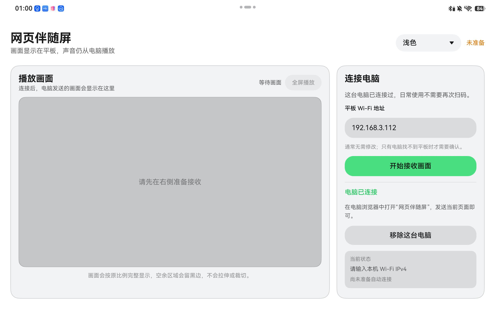
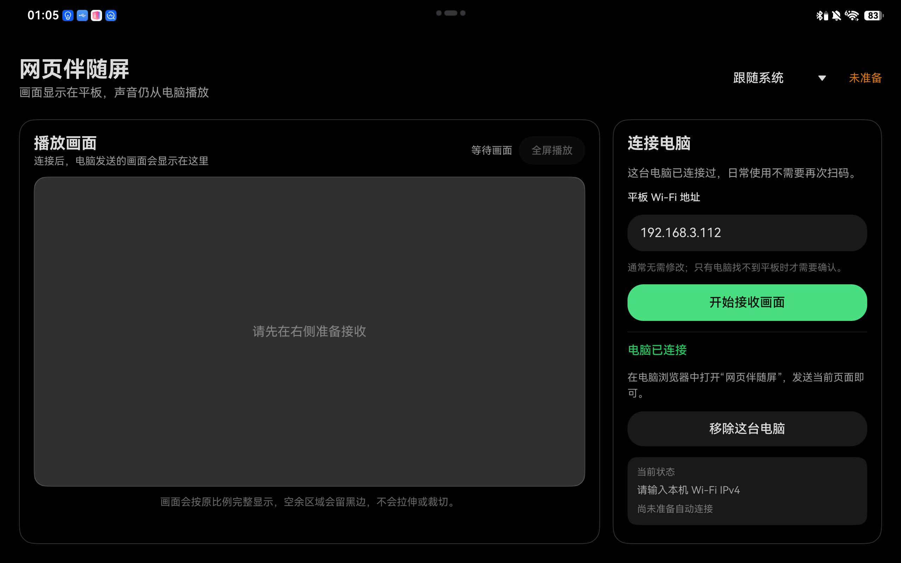

# 2026-07-26 平板端日常播放体验截图

## 结论

用户在同一台 HarmonyOS 平板上检查了浅色与深色界面，并确认当前整体体验满意。截图证明：

- “播放画面”与“连接电脑”已拆为两个独立任务区域；
- 默认应用界面可使用浅色或深色系统语义色；
- 应用背景与顶部系统状态区域在两种主题下保持一致，不再出现明显偏灰或偏蓝的分界；
- 主题选择、播放状态和连接状态在平板横屏布局中保持可见。

## 浅色主题

应用主体与顶部系统状态区域均为中性白色；播放区、连接区使用同一套浅色层级。

## 深色主题

应用主体与顶部系统状态区域均为中性黑色；卡片边界和输入区不再带明显蓝色底色。

## 证据边界

这两张截图是界面与主题的一次真机视觉验收，不单独证明：

- 实际捕获或显示已经持续达到 60 fps；
- 全屏退出控件的点击显示与 5 秒自动隐藏；
- 息屏、解锁和 Surface 重建后的连续播放恢复；
- #3 要求的 30 分钟稳定性、延迟、音画偏移和断连恢复指标。

上述行为分别由自动化、Release 构建和后续真机步骤验证，不能用静态截图替代。
